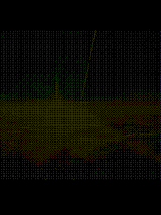

---

<table width="100%">
<tr>

<td width="75%" valign="top">

<table width="100%">
<tr>

<td width="70%" valign="top">

## 🎀 About Me

Hi! I'm **Mouli Biswas** 👩🏻‍💻

🎓 3rd Year B.Tech Information Technology Student  
💻 Aspiring Software Development Engineer  
🌐 Web Development Enthusiast  
🤖 AI/ML Enthusiast  
🧠 Exploring RAG & Generative AI  
📱 Exploring Android Development  
🌱 Always learning, building and experimenting

</td>

<td width="30%" valign="top" align="center">

## 💌 Let's Connect

  

  

</td>

</tr>
</table>

</td>

<td width="25%" valign="middle" align="center">

</td>

</tr>
</table>

## 🛠️ Languages & Tools

---

### 📊 GitHub Stats:

<table>
<tr>
<td align="center">

</td>
</tr>
</table>
## ✨ GitHub Highlights

